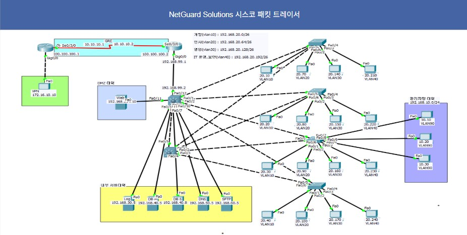
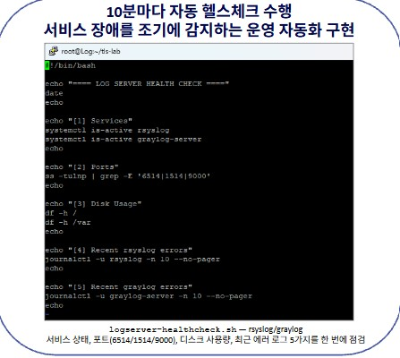

# GrayGuard | 기업 보안 인프라 설계·구축

> 부서별 네트워크와 서버망을 분리하고 서비스에 필요한 통신만 허용하도록 구성한 팀 프로젝트입니다. 저는 서버 담당으로 MariaDB 복제·보호, DNS·SFTP 구축, 서버 계정 보안을 맡았습니다.

| 기간 | 팀 | 나의 역할 |
| --- | --- | --- |
| 2026.04.13–04.24 | 이스트캠프 가디언즈 1차 프로젝트, Infra SEC (최종 3명) | 서버 담당: MariaDB, BIND9 DNS, OpenSSH/SFTP, 계정 보안 |

<table>
  <tr>
    <td width="55%" valign="top">
      <h2>한눈에 보기</h2>
      <p><strong>목표</strong><br>DMZ와 내부 서버망, 부서별 사용자망을 분리하고 Web–DB 접근, 내부 파일 전송, 중앙 로그 수집에 필요한 경로를 통제했습니다.</p>
      <p><strong>내가 맡은 일</strong></p>
      <ul>
        <li>MariaDB Master–Slave 복제 구성과 DB 계정·감사 로그·백업·TLS 설정</li>
        <li>BIND9 DNS 질의 범위 제한과 SFTP 계정의 <code>chroot</code> 격리</li>
        <li>서버 계정 비밀번호 정책, 로그인 실패 잠금, SSH root 직접 접속 제한</li>
      </ul>
      <p><strong>핵심 교훈</strong><br>복제와 백업을 구성하는 것만으로 장애 복구가 끝나지 않습니다. 연결·권한·로그를 확인하고, 복원과 장애 전환은 별도 시험으로 입증해야 합니다.</p>
    </td>
    <td width="45%" valign="top">
      
      <p><sub>프로젝트 네트워크 구성도. 설계된 전체 구조를 보여주며 각 구간의 운영 검증 범위와는 구분합니다.</sub></p>
    </td>
  </tr>
</table>

## 프로젝트 목표와 구조

가상의 기업 NetGuard Solutions에서 개발·인사·영업·IT보안 부서가 Web, DB, DNS, 파일 전송 서비스를 사용한다고 가정했습니다. 외부에 공개할 Web을 DMZ에, DB·DNS·SFTP·Log 서버를 내부망에 배치했습니다. 부서별 사용자망은 VLAN으로 나누고 pfSense 정책으로 필요한 경로를 허용했습니다. 서버 로그는 rsyslog를 거쳐 Log 서버와 Graylog에 모으도록 설계했습니다.

```text
외부 사용자 → pfSense → Web(DMZ) → MariaDB
내부 직원 ──────────────→ SFTP(부서별 계정 격리)
내부 서버 ── rsyslog/TLS ─→ Log 서버 → Graylog
관리자 ─── 허용 IP + adminuser ─→ SSH / 필요할 때 sudo
```

이 구성은 팀 전체 결과입니다. 네트워크 설계·pfSense 정책·Web 서버·Graylog의 기초 구축을 제 개인 작업으로 표기하지 않았습니다.

계획서에는 관리자 전용망, VPN 외부 접속, 외부 DNS/웹 서비스도 포함됐습니다. 최종 보고서는 내부 실습망의 통신과 서버 기능을 중심으로 검증했으며 외부 연결은 성공하지 못했다고 명시합니다. 아래에서는 계획된 구조와 확인된 구현을 구분했습니다.

### 네트워크 분리와 서비스 경로 · 팀 구현

| 구간 | 주소·정책 | 확인 내용 |
| --- | --- | --- |
| 사용자망 | `192.168.20.0/24`, 부서별 VLAN | 일반 사용자에서 DB로 직접 접근하는 경로 차단 |
| DMZ | `192.168.254.0/24`, Web `192.168.254.10` | HTTP→HTTPS 전환, Web–DB 연결 |
| 내부 서버망 | DB `192.168.40.5`, DNS `192.168.50.5`, Log `192.168.30.5` | 필요한 서버 간 통신만 허용 |
| 파일 전송망 | SFTP `192.168.60.5` | 내부 직원의 부서별 계정 접근 |
| 로그 경로 | 서버 → TLS `6514` → Log 서버 → Graylog | Web·DB·SFTP·인증 로그 수신 |


<sub>부서별 네트워크와 서버 연결 토폴로지. 네트워크·방화벽 정책은 팀의 네트워크 담당 작업이며, 서버 담당으로서 허용 경로에서 서비스가 동작하는지 통합 확인에 참여했습니다.</sub>

## 나의 역할과 구현

### 1. MariaDB 복제와 데이터 보호

DB는 DMZ의 Web과 분리해 내부 서버망에 두었습니다. 일반 사용자망에서 DB 포트에 직접 접근하지 못하게 하고, Web 서비스·관리·복제·백업 계정을 용도별로 나눴습니다. 결과보고서의 정책 설명에는 Web 외 관리망·Log 서버 접근 예외도 있어 모든 연결을 일률적으로 “Web만 접근”이라고 표현하지 않았습니다.

1. **Master–Slave 복제:** MariaDB 복제 구성을 수행했습니다. 개인 회고에 데이터 이중화와 가용성의 중요성을 배운 작업으로 기록했습니다. 보고서에는 복제 지연, 장애 시 승격, 애플리케이션 읽기 분산의 측정 자료가 없어 그 효과를 검증 성과로 쓰지 않았습니다.
2. **계정 정책:** `simple_password_check`를 설치하고 최소 12자, 숫자·대소문자·특수문자 조건을 `/etc/my.cnf.d/z-custom-my.cnf`에 설정했습니다. `admin_user`, `repl_user`, `webapp_user` 등의 비밀번호를 변경했습니다.
3. **감사 기록:** `server_audit`의 `CONNECT`·`QUERY_DCL` 이벤트를 활성화해 DB 접속과 권한 변경을 추적하도록 했습니다.
4. **최소 권한 백업:** `mariadb-backup` 전용 계정에 `RELOAD`, `PROCESS`, `LOCK TABLES`, `BINLOG MONITOR`만 부여했습니다. `full_backup.sh` 실행 시 `mariabackup`의 테이블스페이스 복사 로그와 날짜별 백업 디렉터리 생성을 확인했습니다.
5. **전송 보호:** 자체 CA로 서버 인증서를 발급하고 OpenSSL 검증(`server-cert.pem: OK`) 후 MariaDB TLS 설정을 적용해 서버를 재시작했습니다. 실제 접속 세션의 암호화 여부를 측정한 자료는 보고서에 없습니다.

전체 백업 파일 생성과 인증서 검증은 기록돼 있습니다. 백업 **복원**, 자동 장애 전환, 복제 지연·데이터 정합성의 장기 검증은 별도 과제로 남았습니다. 복제본은 백업 파일이나 복원 시험을 대신하지 않습니다.

### 2. DNS·SFTP와 서버 접근 제어

**BIND9 DNS:** 신뢰된 내부 대역만 질의하도록 `allow-query`를 제한하고 Zone 전송을 차단했습니다. 팀 통합 과정에서 허용된 IP의 내부 DNS 질의를 확인했습니다. 계획서의 외부 DNS 서비스와 최종 보고서의 내부 실습망 검증은 구분했습니다.

**OpenSSH/SFTP:** 부서별 계정을 스크립트로 만들고 개발(`dev`), 인사(`hr`), 영업(`sales`), IT보안(`itsec`) 계정의 존재와 `/sbin/nologin`을 확인했습니다. `Match Group sftpusers`에서 `chroot`로 디렉터리를 격리하고 터널링·포트 포워딩을 차단했습니다. 결과보고서에는 계정별 접속·업로드 권한, 상위 디렉터리 이동 차단, 비인가 파일 업로드 제한 시연이 정리돼 있습니다.

**공통 계정·SSH 보안:** Web·DB·DNS·SFTP·Log 서버에 같은 기준을 적용해 서버별 보안 설정 편차를 줄였습니다.

| 설정 위치 | 적용 내용 | 목적·확인 |
| --- | --- | --- |
| `/etc/security/pwquality.conf` | 최소 10자, 문자 조합·반복 제한, root에도 적용 | 약한 로컬 계정 비밀번호 제한 |
| `/etc/login.defs` | `PASS_MAX_DAYS 90`, `PASS_MIN_DAYS 1`, `PASS_WARN_AGE 7` | 사용 기간과 만료 전 경고 |
| `/etc/security/faillock.conf` | 5회 실패 시 600초 잠금, root 포함 | 반복 로그인 시도 지연 |
| `wheel`/sudo | `adminuser`에 관리자 권한 위임 | 일반 계정 로그인 후 `sudo whoami` 확인 |
| `/etc/ssh/sshd_config` | `PermitRootLogin no`, `MaxAuthTries 3`, `AllowUsers adminuser` | root 직접 로그인 차단, 허용 사용자 제한 |

MariaDB의 **최소 12자 DB 계정 정책**과 OS의 **최소 10자 로컬 계정 정책**은 적용 대상이 다른 별도 설정입니다. SSH는 서버 설정과 네트워크의 관리자 IP 허용 정책을 함께 사용했습니다.

### 3. 팀 통합과 확인

Web–DB 연결, 내부 DNS 질의, SFTP 접속, 중앙 로그 수신을 팀과 함께 확인했습니다. 결과보고서에는 HTTP→HTTPS 전환, root SSH 접속 차단 후 `adminuser`의 sudo 사용, SFTP 격리, `logger`·`tcpdump`를 통한 로그 수신과 TLS 전송 확인 절차가 기록돼 있습니다. Web 서버·pfSense·Graylog의 기초 구축은 팀원 담당 작업입니다.

## 팀 통합 결과와 운영 증거

### 중앙 로그 수집과 서비스별 분류

Log 서버의 `rsyslog`는 X.509 인증서를 사용해 TLS `6514` 포트로 로그를 받도록 구성했습니다. SFTP 서버 등 송신 측도 CA 인증서를 검증하고 전송 큐를 사용했습니다. 결과보고서는 Web·DB·SFTP·인증 로그가 Log 서버에 들어오는 화면과 `logger`·`tcpdump`를 통한 전송 확인 절차를 제시합니다. 이는 팀의 로그 서버 작업입니다.


<sub>Web·DB·SFTP·인증 로그 수신 확인. 로그가 한 서버에 모였다는 증거이며 모든 탐지 규칙이나 경보가 완성됐다는 뜻은 아닙니다.</sub>

수집한 로그는 서비스에 따라 `/var/log/web`, `/var/log/db`, `/var/log/remote` 등으로 나눠 저장했습니다. 사고 조사 시 서비스 출처를 먼저 좁힐 수 있도록 한 구성입니다.


<sub>중앙 수신 후 Web·DB·SFTP 로그를 별도 경로에서 확인한 팀 검증 화면입니다.</sub>

### 로그 보존·백업과 상태 점검

Log 서버에는 `logrotate`의 일일 회전, 30개 보관, 압축, 새 파일 권한 `640`을 적용했습니다. 설정·인증서·원본 로그는 `config-backup`, `certs-backup`, `rawlogs-backup`의 세 종류 `tar.gz`로 분리했고, 매일 새벽 2시 백업을 등록했습니다. 이는 **Log 서버 백업**으로, 위 MariaDB 전체 백업과 구분됩니다.


<sub>세 종류의 Log 서버 백업 파일 생성 결과. 실제 복원 시험의 근거는 보고서에 없습니다.</sub>

`logserver-healthcheck.sh`는 rsyslog·Graylog 서비스, `6514/1514/9000` 포트, 디스크 사용량, 최근 오류 로그를 점검합니다. `cron`에 10분 간격으로 등록하고 결과를 로그 파일로 남겼습니다. 이는 개별 운영 점검 스크립트이며, 결과보고서의 한계 항목에 적힌 **포괄적인 운영·보안 점검 자동화**를 완료했다는 뜻은 아닙니다.


<sub>Log 서버의 주기 점검 스크립트. 서비스와 포트 상태를 확인하는 운영 근거입니다.</sub>

### 기능 시연과 해석

| 시연·확인 | 결과보고서에 기록된 내용 | 해석 범위 |
| --- | --- | --- |
| Web 접속 | HTTP→HTTPS 전환, `/admin` 접근 제한 | 외부 인터넷에서 공개 운영한 검증은 아님 |
| DB 경로 | Web–DB 연동, 비인가 출발지의 DB 직접 접근 제한 | 부하 분산·자동 장애 전환은 별도 검증 필요 |
| 관리자 접속 | root SSH 거부, `adminuser` 접속 후 sudo 확인 | 허용 IP·계정 정책의 실습망 시연 |
| SFTP | 부서 계정별 디렉터리·업로드 권한과 상위 경로 차단 | 내부 사용자 대상 기능 |
| 로그 | 테스트 이벤트 수신, TLS 전송 및 UI·파일 저장 확인 | Graylog 알림·자동 대응 완료의 근거는 아님 |

## 어려웠던 점과 배운 점

- **서버 기능과 정책의 균형:** 연결을 막기만 하면 Web–DB, DNS, SFTP 기능도 함께 멈춥니다. 서비스 흐름을 먼저 정리하고 필요한 목적지와 포트만 허용하는 방식으로 팀 통합을 진행했습니다.
- **복제와 복구의 차이:** Master–Slave 복제와 백업 성공은 확인했지만, 실제 백업 복원이나 자동 장애 전환은 별도 검증이 필요합니다. 이후 프로젝트에서는 복원 절차와 장애 상황 시험을 먼저 계획해야 한다는 점을 배웠습니다.
- **운영 증거의 중요성:** 설정 파일만으로는 동작을 설명하기 어렵습니다. 접속·차단·로그 수신 결과를 함께 남겨야 보안 정책을 검토하고 인계할 수 있습니다.

## 기술 스택

`Rocky Linux` · `MariaDB` · `BIND9` · `OpenSSH/SFTP` · `rsyslog` · `Graylog` · `pfSense` · `Apache/PHP`

> **범위:** 교육용 내부 실습망 프로젝트입니다. 결과보고서는 실장비·실트래픽 부하 시험을 하지 않았고 외부 연결 구현은 성공하지 못했다고 명시합니다. WAF·IDS/IPS, 완전한 HA, Graylog 알림 규칙, 포괄적인 운영·보안 점검 자동화도 후속 과제입니다. 계획서의 VPN과 관리자 전용망은 설계 항목으로, 최종 자료만으로 운영 검증을 주장하지 않습니다.

다음 단계는 DB 백업 복원과 복제 장애 전환 시험, 로그 알림 기준 정의, 인증서 갱신 절차, 구성 재현 자동화입니다.

### 자료 기준

이 문서는 Google Drive의 **1차 프로젝트 계획서**(3–12쪽: 목표·구조·초기 범위), **1차 프로젝트 결과보고서**(11쪽: 역할, 18–26쪽: 망·정책, 27–41쪽: 계정·SFTP·DNS·DB, 47–55쪽: 로그·시연, 58–60쪽: 한계·회고), 프로젝트 이미지 6장을 대조해 작성했습니다. 계획과 결과가 다르게 말하는 부분은 최종 결과보고서의 검증 범위를 기준으로 했습니다. 이미지마다 해당 작업과 해석 범위를 바로 옆에 적고, 팀 전체 구현과 제 서버 담당 작업을 구분했습니다.
